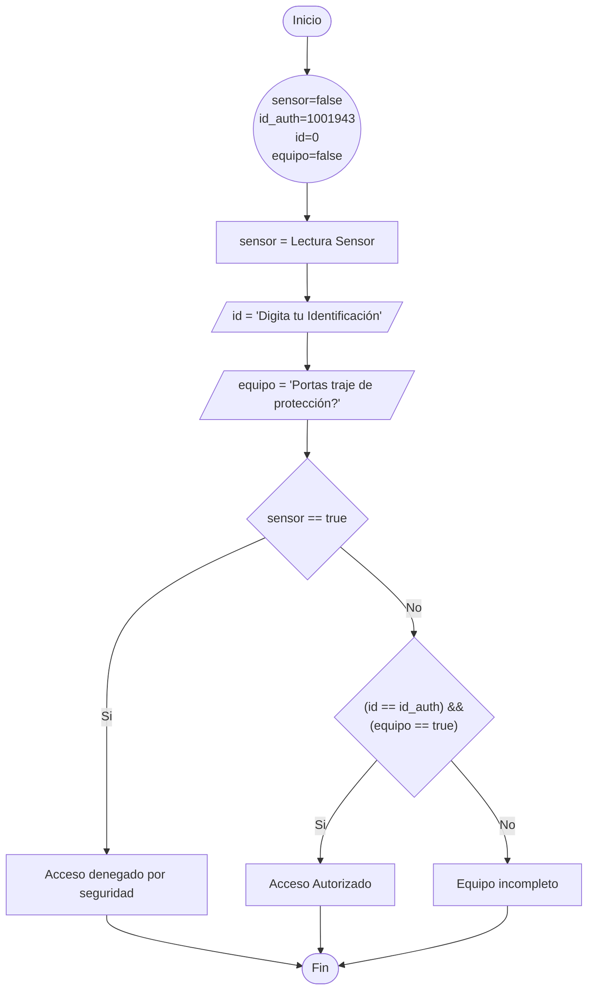

```mermaid
graph TD
    A([Inicio]) --> B(("sensor=false<br/>id_auth=1001943<br/>id=0<br/>equipo=false"))
    B --> C[sensor = Lectura Sensor]
    C --> D[/id = 'Digita tu Identificación'/]
    D --> E[/equipo = 'Portas traje de protección?'/]

    E --> F{sensor == true}

    F -- Si --> G["Acceso denegado por seguridad"]
    F -- No --> H{"(id == id_auth) &&<br/>(equipo == true)"}

    H -- Si --> I["Acceso Autorizado"]
    H -- No --> J["Equipo incompleto"]

    G --> K([Fin])
    I --> K
    J --> K
```
