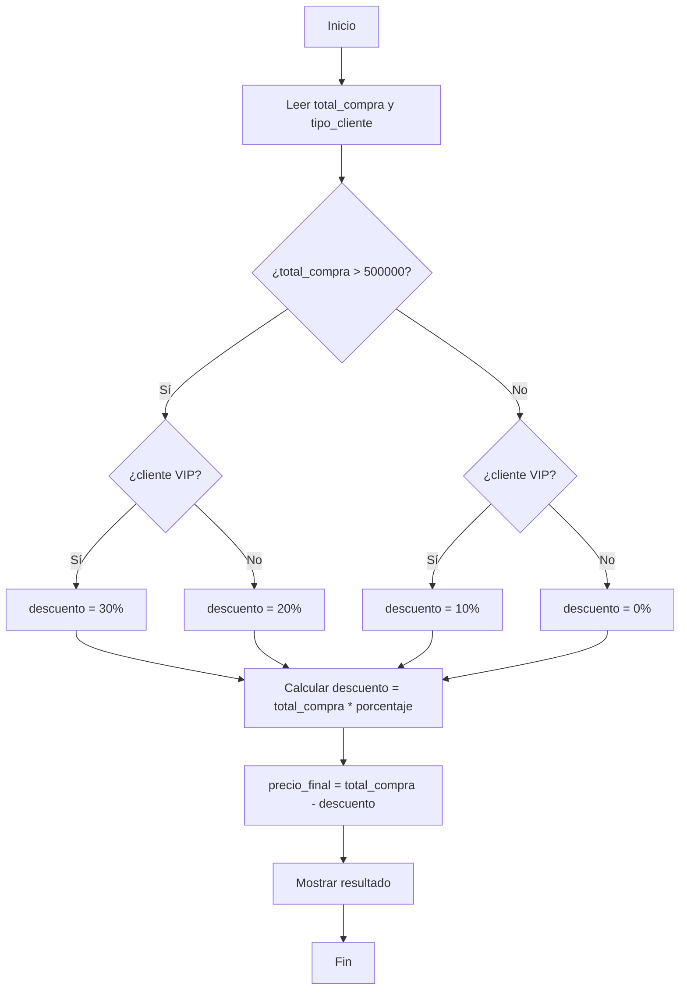

```mermaid
graph TD
    A[Inicio] --> B[Leer total_compra y tipo_cliente]
    B --> C{¿total_compra > 500000?}

    C -- Sí --> D{¿cliente VIP?}
    C -- No --> E{¿cliente VIP?}

    D -- Sí --> F[descuento = 30%]
    D -- No --> G[descuento = 20%]

    E -- Sí --> H[descuento = 10%]
    E -- No --> I[descuento = 0%]

    F --> J[Calcular descuento = total_compra * porcentaje]
    G --> J
    H --> J
    I --> J

    J --> K[precio_final = total_compra - descuento]
    K --> L[Mostrar resultado]
    L --> M[Fin]
```