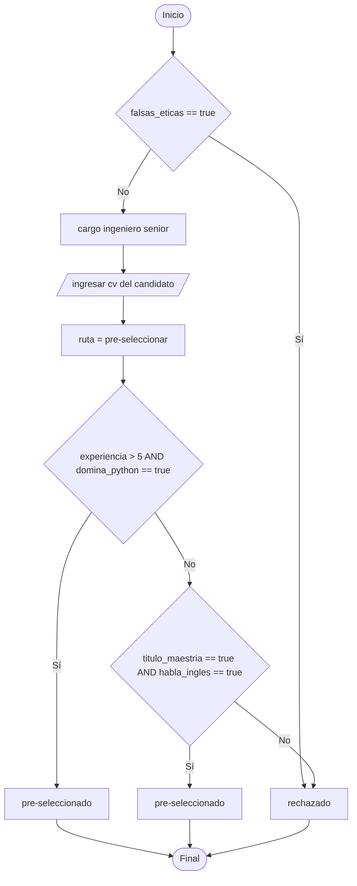

```mermaid
graph TD
    A([Inicio]) --> B{falsas_eticas == true}

    B -- Sí --> Z[rechazado]
    B -- No --> C[cargo ingeniero senior]

    C --> D[/ingresar cv del candidato/]
    D --> E[ruta = pre-seleccionar]

    E --> F{experiencia > 5 AND domina_python == true}

    F -- Sí --> G[pre-seleccionado]
    F -- No --> H{titulo_maestria == true AND habla_ingles == true}

    H -- Sí --> I[pre-seleccionado]
    H -- No --> Z

    G --> J([Final])
    I --> J
    Z --> J
```