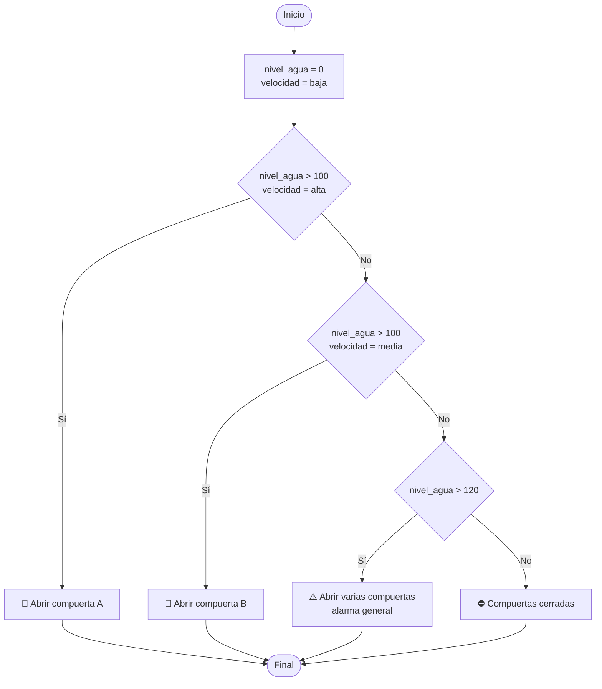

```mermaid
graph TD
    A([Inicio]) --> B[nivel_agua = 0\nvelocidad = baja]

    B --> C{nivel_agua > 100\nvelocidad = alta}

    C -- Sí --> D[🚪 Abrir compuerta A]
    C -- No --> E{nivel_agua > 100\nvelocidad = media}

    E -- Sí --> F[🚪 Abrir compuerta B]
    E -- No --> G{nivel_agua > 120}

    G -- Sí --> H[⚠️ Abrir varias compuertas\nalarma general]
    G -- No --> I[⛔ Compuertas cerradas]

    D --> J([Final])
    F --> J
    H --> J
    I --> J
```