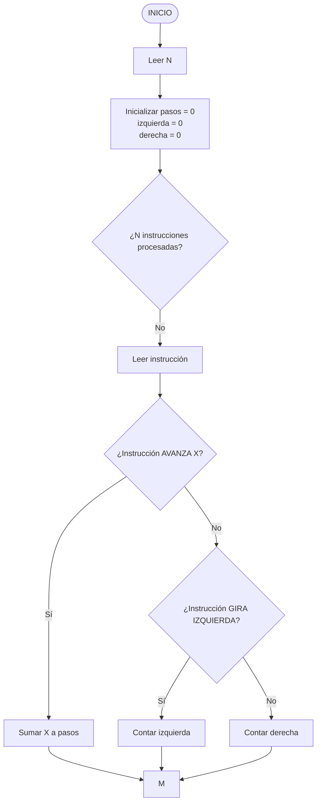

```mermaid
graph TD
        A([INICIO]) --> B[Leer N]
    B --> C[Inicializar pasos = 0<br/>izquierda = 0<br/>derecha = 0]
    C --> D{¿N instrucciones procesadas?}

    D -- No --> E[Leer instrucción]
    E --> F{¿Instrucción AVANZA X?}

    F -- Sí --> G[Sumar X a pasos]
    G --> M

    F -- No --> H{¿Instrucción GIRA IZQUIERDA?}

    H -- Sí --> I[Contar izquierda]
    I --> M

    H -- No --> J[Contar derecha]
    J --> M
```