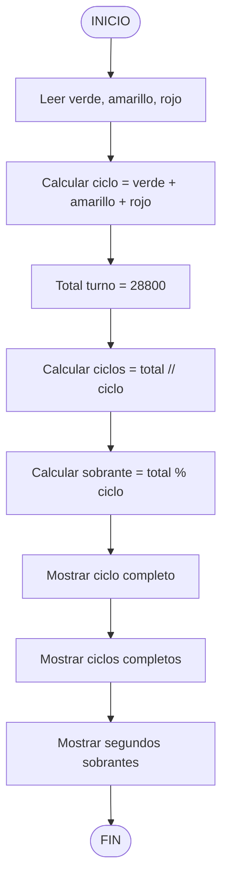

```mermaid
graph TD
    A([INICIO]) --> B[Leer verde, amarillo, rojo]

    B --> C[Calcular ciclo = verde + amarillo + rojo]

    C --> D[Total turno = 28800]

    D --> E[Calcular ciclos = total // ciclo]

    E --> F[Calcular sobrante = total % ciclo]

    F --> G[Mostrar ciclo completo]

    G --> H[Mostrar ciclos completos]

    H --> I[Mostrar segundos sobrantes]

    I --> J([FIN])
```
