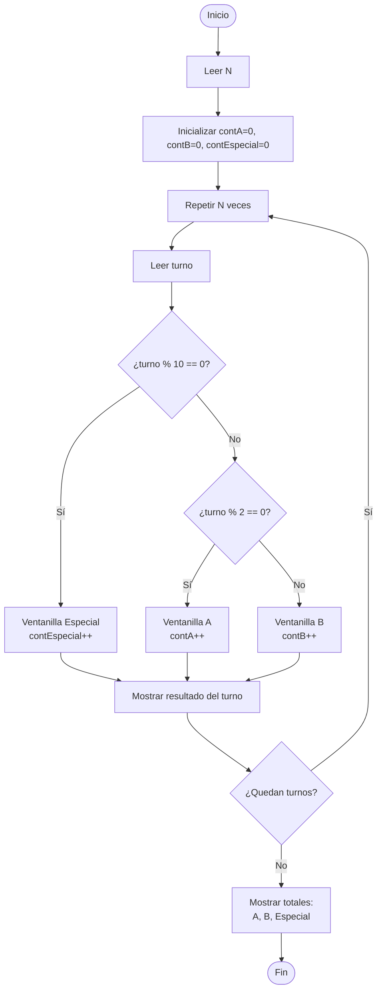

```mermaid
graph TD
    A([Inicio]) --> B[Leer N]
    B --> C[Inicializar contA=0, contB=0, contEspecial=0]
    C --> D[Repetir N veces]
    
    D --> E[Leer turno]
    E --> F{¿turno % 10 == 0?}
    
    F -- Sí --> G[Ventanilla Especial<br/>contEspecial++]
    
    F -- No --> H{¿turno % 2 == 0?}
    H -- Sí --> I[Ventanilla A<br/>contA++]
    H -- No --> J[Ventanilla B<br/>contB++]
    
    G --> K[Mostrar resultado del turno]
    I --> K
    J --> K
    
    K --> L{¿Quedan turnos?}
    L -- Sí --> D
    L -- No --> M[Mostrar totales:<br/>A, B, Especial]
    
    M --> N([Fin])
```